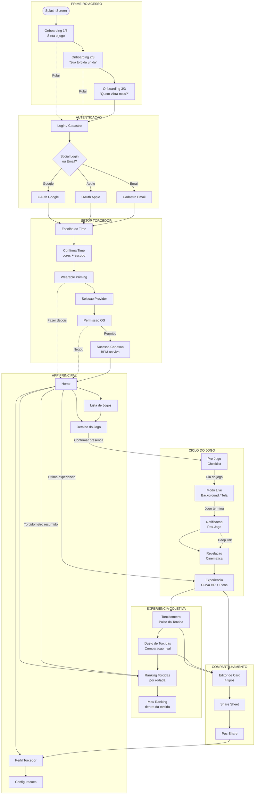
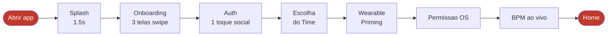
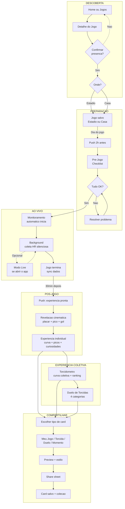
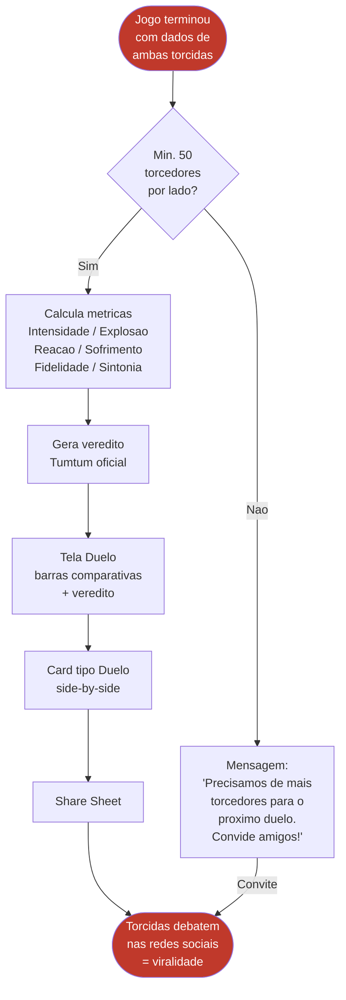
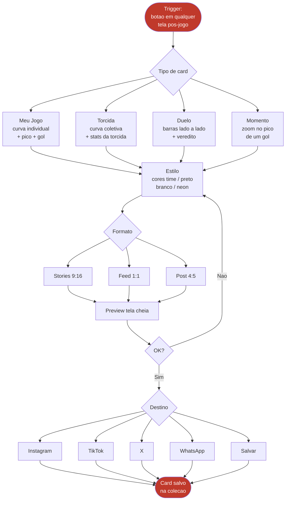
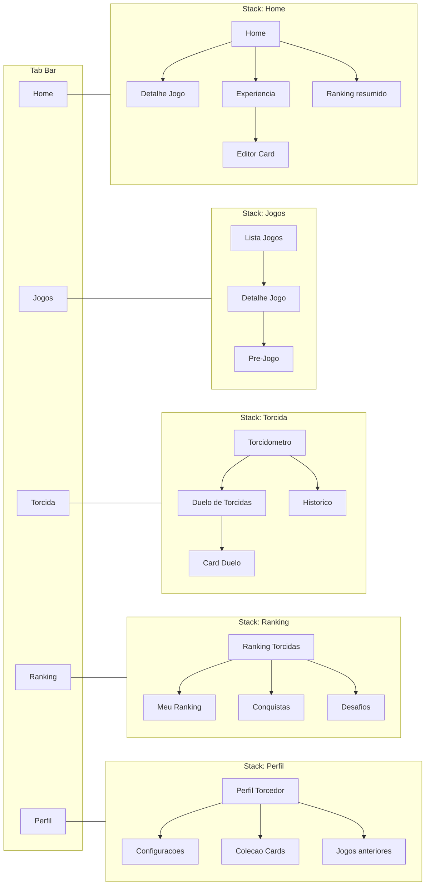
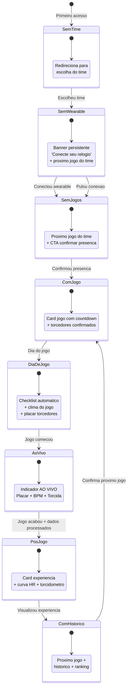
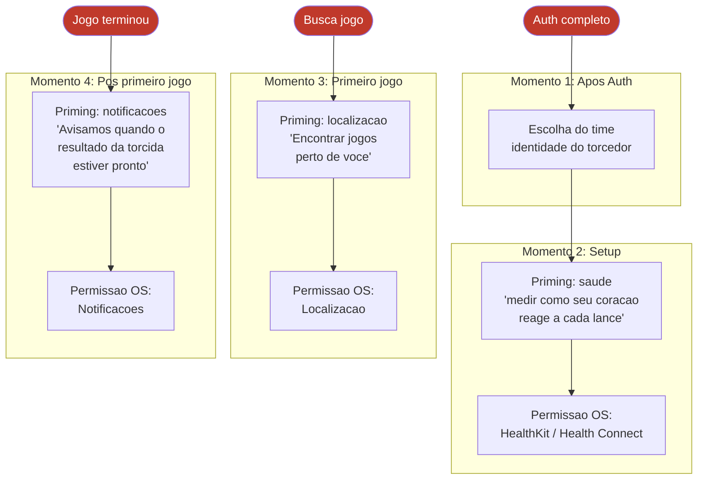

# Tumtum — Diagrama de Fluxo UX Completo

> Foco: Futebol & Experiencia de Torcida
> Todas as telas e transicoes do app, do primeiro acesso ao duelo de torcidas

---

## Fluxo Geral (Visao Macro)

---

## Fluxo Detalhado: Primeiro Acesso (Happy Path)

**Tempo estimado: < 2 minutos** do primeiro toque ate a Home (inclui escolha do time)

---

## Fluxo Detalhado: Ciclo Completo do Jogo

---

## Fluxo Detalhado: Duelo de Torcidas

---

## Fluxo Detalhado: Compartilhamento (4 tipos de card)

---

## Navegacao por Tab Bar

---

## Mapa de Estados da Tela Home

---

## Ciclo de Engajamento Semanal

```mermaid
flowchart LR
    subgraph SEG_QUA["Seg-Qua: Entre jogos"]
        A1[Ranking da rodada<br/>atualizado]
        A2[Desafio semanal<br/>lancado]
        A3[Push: Ranking<br/>do seu time]
    end

    subgraph QUI_SEX["Qui-Sex: Pre-jogo"]
        B1[Proximo jogo<br/>aparece na Home]
        B2[Confirmar presenca]
        B3[Push: X torcedores<br/>ja confirmaram]
    end

    subgraph SAB_DOM["Sab-Dom: Dia do jogo"]
        C1[Pre-jogo checklist]
        C2[Monitoramento live]
        C3[Pos-jogo: revelacao]
        C4[Experiencia + torcida]
        C5[Duelo + cards]
    end

    SEG_QUA --> QUI_SEX
    QUI_SEX --> SAB_DOM
    SAB_DOM --> SEG_QUA

    style SEG_QUA fill:#f5f5f8,stroke:#C0392B
    style QUI_SEX fill:#f5f5f8,stroke:#E74C3C
    style SAB_DOM fill:#C0392B,color:#fff
```

**O app tem motivo para ser aberto TODOS OS DIAS, nao so em dia de jogo.**

---

## Fluxo de Permissoes (Progressive)

---

## Inventario de Telas

| # | Tela | Fluxo | Prioridade |
|---|------|-------|------------|
| 0 | Splash | Primeiro acesso | P0 |
| 1 | Onboarding 1/3 | Primeiro acesso | P0 |
| 2 | Onboarding 2/3 | Primeiro acesso | P0 |
| 3 | Onboarding 3/3 | Primeiro acesso | P0 |
| 4 | Login/Cadastro | Auth | P0 |
| 5 | Escolha do Time | Setup | P0 |
| 5b | Confirma Time | Setup | P0 |
| 6 | Wearable Priming | Setup | P0 |
| 7 | Selecao Provider | Setup | P0 |
| 8 | Sucesso Conexao | Setup | P0 |
| 9 | Home | Core | P0 |
| 10 | Jogos (lista) | Core | P0 |
| 11 | Detalhe do Jogo | Core | P0 |
| 12 | Pre-Jogo | Jogo | P0 |
| 13 | Modo Live | Jogo | P1 |
| 14 | Revelacao | Pos-jogo | P0 |
| 15 | Experiencia | Pos-jogo | P0 |
| 16 | Torcidometro | Torcida | P0 |
| 17 | Duelo de Torcidas | Torcida | P1 |
| 18 | Editor de Card | Share | P0 |
| 19 | Ranking Torcidas | Ranking | P1 |
| 20 | Meu Ranking | Ranking | P1 |
| 21 | Perfil Torcedor | Perfil | P0 |
| 22 | Configuracoes | Settings | P1 |

**23 telas | 17 no MVP (P0) | 6 adicionais na Fase 2 (P1)**
