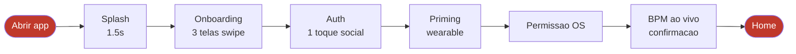
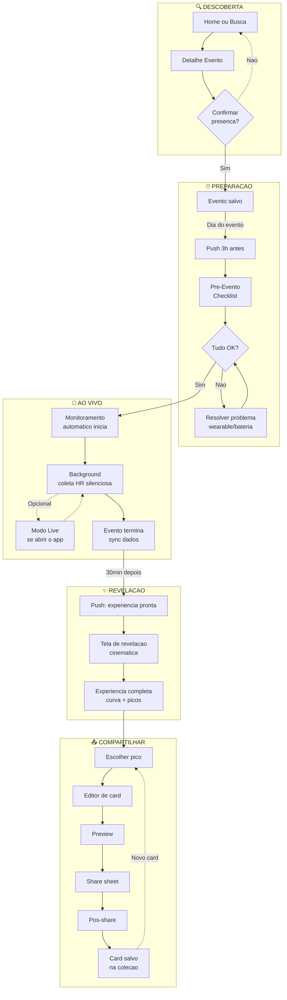
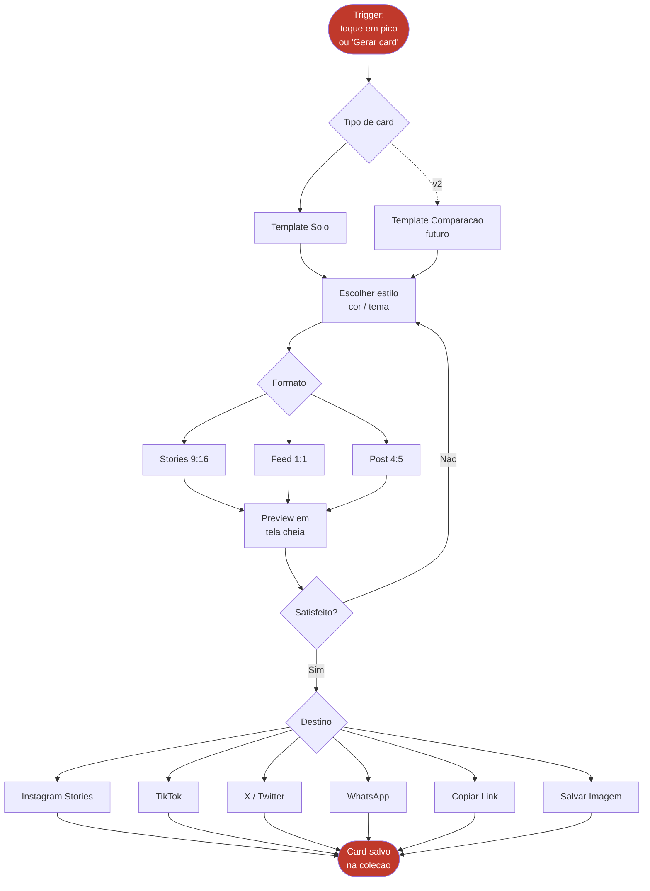
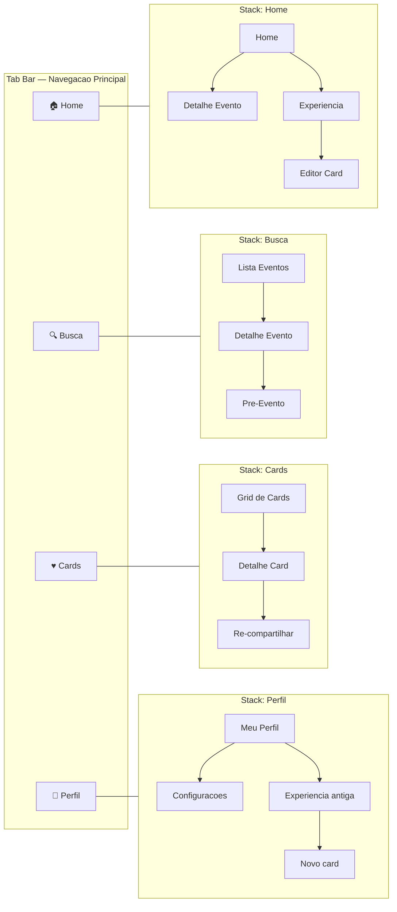
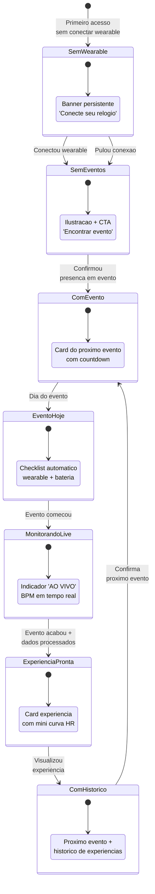
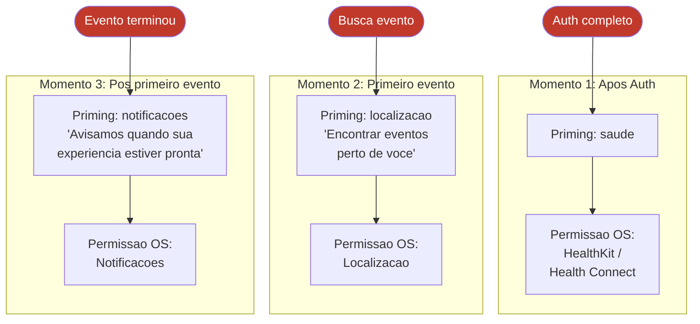

# Tumtum — Diagrama de Fluxo UX Completo

> Todas as telas e transicoes do app, do primeiro acesso ao compartilhamento

---

## Fluxo Geral (Visao Macro)

```mermaid
flowchart TD
    subgraph PRIMEIRO_ACESSO["🟡 PRIMEIRO ACESSO"]
        SPLASH([Splash Screen])
        ON1[Onboarding 1/3<br/>'Sinta cada momento']
        ON2[Onboarding 2/3<br/>'Descubra seus picos']
        ON3[Onboarding 3/3<br/>'Compartilhe a emocao']
    end

    subgraph AUTH["🔐 AUTENTICACAO"]
        LOGIN[Login / Cadastro]
        SOCIAL{Social Login<br/>ou Email?}
        OAUTH_GOOGLE[OAuth Google]
        OAUTH_APPLE[OAuth Apple]
        SIGNUP[Cadastro Email]
    end

    subgraph WEARABLE["⌚ CONEXAO WEARABLE"]
        PRIMING[Tela de Priming<br/>'Conecte seu relogio']
        PROVIDER[Selecao de Provider]
        OS_PERM[Permissao do OS<br/>HealthKit / Health Connect]
        SUCESSO_CONN[Sucesso Conexao<br/>BPM ao vivo]
    end

    subgraph CORE["🏠 APP PRINCIPAL"]
        HOME[Home]
        BUSCA[Busca de Eventos]
        DETALHE_EVT[Detalhe do Evento]
        PERFIL[Meu Perfil]
        COLECAO[Colecao de Cards]
        CONFIG[Configuracoes]
    end

    subgraph EVENTO["🎵 CICLO DO EVENTO"]
        PRE_EVT[Pre-Evento<br/>Checklist]
        LIVE[Modo Live<br/>Background / Tela]
        NOTIF_POS[Notificacao<br/>Pos-Evento]
        REVELACAO[Revelacao<br/>Cinematica]
        EXPERIENCIA[Experiencia<br/>Curva HR + Picos]
    end

    subgraph SHARE["📤 COMPARTILHAMENTO"]
        EDITOR[Editor de Card]
        PREVIEW[Preview Card]
        SHARE_SHEET[Share Sheet<br/>Redes Sociais]
        POS_SHARE[Pos-Share<br/>Celebracao]
    end

    %% PRIMEIRO ACESSO
    SPLASH --> ON1
    ON1 --> ON2
    ON2 --> ON3
    ON1 -.->|Pular| LOGIN
    ON2 -.->|Pular| LOGIN
    ON3 --> LOGIN

    %% AUTH
    LOGIN --> SOCIAL
    SOCIAL -->|Google| OAUTH_GOOGLE
    SOCIAL -->|Apple| OAUTH_APPLE
    SOCIAL -->|Email| SIGNUP
    OAUTH_GOOGLE --> PRIMING
    OAUTH_APPLE --> PRIMING
    SIGNUP --> PRIMING

    %% WEARABLE
    PRIMING --> PROVIDER
    PRIMING -.->|Fazer depois| HOME
    PROVIDER --> OS_PERM
    OS_PERM -->|Permitiu| SUCESSO_CONN
    OS_PERM -.->|Negou| HOME
    SUCESSO_CONN --> HOME

    %% CORE NAV
    HOME --> BUSCA
    HOME --> PERFIL
    HOME --> COLECAO
    HOME --> DETALHE_EVT
    BUSCA --> DETALHE_EVT
    PERFIL --> CONFIG
    PERFIL --> COLECAO
    COLECAO --> EDITOR

    %% CICLO DO EVENTO
    DETALHE_EVT -->|'Eu vou!'| PRE_EVT
    PRE_EVT -->|Dia do evento| LIVE
    LIVE -->|Evento termina| NOTIF_POS
    NOTIF_POS --> REVELACAO
    REVELACAO --> EXPERIENCIA

    %% SHARE
    EXPERIENCIA --> EDITOR
    EDITOR --> PREVIEW
    PREVIEW --> SHARE_SHEET
    SHARE_SHEET --> POS_SHARE
    POS_SHARE --> COLECAO
    POS_SHARE -.-> EXPERIENCIA

    %% ATALHOS
    HOME -->|Ultima experiencia| EXPERIENCIA
    NOTIF_POS -.->|Deep link| REVELACAO

    %% ESTILOS
    classDef primeiro fill:#2d2d3d,stroke:#C0392B,color:#F0F0F5
    classDef auth fill:#1a1a2e,stroke:#E74C3C,color:#F0F0F5
    classDef wearable fill:#1a1a2e,stroke:#00D2FF,color:#F0F0F5
    classDef core fill:#111118,stroke:#6B6B80,color:#F0F0F5
    classDef evento fill:#1a1a2e,stroke:#C0392B,color:#F0F0F5
    classDef share fill:#2d1a1a,stroke:#E74C3C,color:#F0F0F5

    class SPLASH,ON1,ON2,ON3 primeiro
    class LOGIN,SOCIAL,OAUTH_GOOGLE,OAUTH_APPLE,SIGNUP auth
    class PRIMING,PROVIDER,OS_PERM,SUCESSO_CONN wearable
    class HOME,BUSCA,DETALHE_EVT,PERFIL,COLECAO,CONFIG core
    class PRE_EVT,LIVE,NOTIF_POS,REVELACAO,EXPERIENCIA evento
    class EDITOR,PREVIEW,SHARE_SHEET,POS_SHARE share
```

---

## Fluxo Detalhado: Primeiro Acesso (Happy Path)

**Tempo estimado: < 90 segundos** do primeiro toque ate a Home

---

## Fluxo Detalhado: Ciclo Completo do Evento

---

## Fluxo Detalhado: Compartilhamento

---

## Navegacao por Tab Bar

---

## Mapa de Estados da Tela Home

---

## Fluxo de Permissoes (Progressive)

**Regra de ouro:** Cada permissao e pedida NO MOMENTO em que faz sentido para o usuario, nunca tudo de uma vez.

---

## Inventario de Telas

| # | Tela | Fluxo | Prioridade |
|---|------|-------|------------|
| 0 | Splash | Primeiro acesso | P0 |
| 1 | Onboarding 1/3 | Primeiro acesso | P0 |
| 2 | Onboarding 2/3 | Primeiro acesso | P0 |
| 3 | Onboarding 3/3 | Primeiro acesso | P0 |
| 4 | Login/Cadastro | Auth | P0 |
| 5 | Cadastro Email | Auth | P0 |
| 6 | Wearable Priming | Setup | P0 |
| 7 | Selecao Provider | Setup | P0 |
| 8 | Sucesso Conexao | Setup | P0 |
| 9 | Home | Core | P0 |
| 10 | Busca Eventos | Core | P0 |
| 11 | Detalhe Evento | Core | P0 |
| 12 | Pre-Evento | Evento | P1 |
| 13 | Modo Live | Evento | P1 |
| 14 | Revelacao | Pos-evento | P0 |
| 15 | Experiencia | Pos-evento | P0 |
| 16 | Editor de Card | Share | P0 |
| 17 | Share Sheet | Share | P0 |
| 18 | Pos-Share | Share | P0 |
| 19 | Meu Perfil | Perfil | P0 |
| 20 | Perfil Publico | Social | P2 |
| 21 | Configuracoes | Settings | P1 |

**22 telas | 17 no MVP (P0)**
